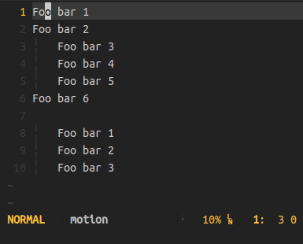

LazyList, <small>a quick way to create lists in Vim</small>
==============================================================


[Description](#description) | [Installation](#installation) | [How to use](#usage) | [How it works](#howitworks) | [Configuration](#configuration) | [TODO](#todo) | [Notes](#notes)

Description <a id="description"></a>
-----------

LazyList is a vim plugin who gives you possibility to create ordered and non ordered lists very quickly, and this by adding indices to the beginning of each line in the current selection.


With non numerical indices, the plugin can even act smartly:


As a bonus, the [selection algorithm](#selection) of the plugin can be used as a text-object, refer to the [configuration part](#text-object).



Installation <a id="installation"></a>
------------

This plugin works great on vim `>=7.4`. If you are using version `7.3`, consider using the [fix-vim73 branch](https://github.com/KabbAmine/lazyList.vim/tree/fix-vim73).

### Manually

Install the distributed files into Vim runtime directory which is usually `~/.vim/`, or `$HOME/vimfiles` on Windows.

### Using a plugin manager

And this is the recommended way, use a vim plugin manager:

| Plugin manager                                           | In vimrc                             | Installation command   |
| -------------------------------------------------------- | ----------------------------------   | ---------------------- |
| [Vim-plug](https://github.com/junegunn/vim-plug)         | `Plug 'KabbAmine/lazyList.vim'`      | `PlugInstall`          |
| [Vundle](https://github.com/gmarik/Vundle.vim)           | `Plugin 'KabbAmine/lazyList.vim'`    | `PluginInstall`        |
| [NeoBundle](https://github.com/Shougo/neobundle.vim)     | `NeoBundle 'KabbAmine/lazyList.vim'` | `NeoBundleInstall`     |

How to use <a id="usage"></a>
-------------

The plugin provides one unique command: `LazyList` which can be used to add/remove indices to/from a selection in NORMAL or VISUAL mode (This command can take 0 or 1 argument(s): The index).

The index can be:
- A character or a string (e.g `+`, `'* '`,`'- '`, `'Chapter X. '`...)
- A special pattern understandable by the plugin:
	* `%number%`: Produces indices starting from `number` (e.g `%1%`, `%33%`...)
- Both of them (e.g `'Chapter 1, part %1% - '`...)

The following examples will be more explicit.

### Unordered list example

If I want to make a list with hyphens (`_` is the current cursor position):

```
Element 1
Eleme_nt 2
Element 3
```

Executing `:LazyList '- '` will produce:

```
- Element 1
- Eleme_nt 2
- Element 3
```

**Note** the single quotes in `'- '`, you should use them if you have space(s) in your index.

### Simple ordered list example

If I want to make an ordered list (`_` is the current cursor position):

```
Element 1
Ele_ment 2
Element 3
```

Executing `:LazyList` will produce :

```
1. Element 1
2. Ele_ment 2
3. Element 3
```
When no argument is given to `LazyList`, the default index `%1%. ` is used.

### Complex ordered list example

I want now to make an ordered list of 1000 elements, with indices from 2 till 1002 (`2- `, `3- `, ` 4- `, ...... `1000- `, `1001- `, `1002- `):

```
Element 1
Ele_ment 2
.
.
.
Element 999
Element 1000
```

A simple `:LazyList '%2%- '` will produce:

```
2- Element 1
3- Ele_ment 2
.
.
.
1001- Element 999
1002- Element 1000
```

The syntax `%2%- ` means:
* `'%2%'` *Create numerical indices starting from 2*.
* `'- '` *Add this string after the numerical indices*.


Nice :smiley:
I change a few things ...

```
2- This is element 1
3- Foo
.
.
.
1001- Bar
1002- Lo_rem ipsum
```

... And now after thinking, I want to remove all those indices, so using the same command `:LazyList '%2%- '` I can do that.

```
This is element 1
Foo
.
.
.
Bar
Lo_rem ipsum
```

A super gif to illustrate the example:


Pretty quick, isn't it? :smile:

Configuration <a id="configuration"></a>
-------------

### Normal mapping(s)

The plugin doesn't set any mapping, so feel free to create your own ones with your patterns:

Example:

```vim
nnoremap gll :LazyList<CR>
vnoremap gll :LazyList<CR>
nnoremap gl* :LazyList '* '<CR>
nnoremap gl* :LazyList '* '<CR>
```

Or in a better way, you can create them dynamically using the `g:lazylist_maps` variable (Check the next part for that).

### Generate mapping(s) dynamically

Setting `g:lazylist_maps` variable in your vimrc will generate dynamically your mappings with their patterns.

This variable is a list containing 2 values:

1. The prefix key
2. A dictionary containing the keys and their patterns.

```vim
let g:lazylist_maps = [
			\ <prefixKey>,
			\ {
				\ <key>  : 'pattern',
				\ <key2>  : 'pattern2'
			\ }
		\]
```

And this will generate:

```vim
nnoremap <prefixKey + key> :LazyList 'pattern'<CR>
vnoremap <prefixKey + key> :LazyList 'pattern'<CR>
nnoremap <prefixKey + key2> :LazyList 'pattern2'<CR>
vnoremap <prefixKey + key2> :LazyList 'pattern2'<CR>
```

So for example, this ...

```vim
let g:lazylist_maps = [
			\ 'gl',
			\ {
				\ 'l'  : '',
				\ '-'  : '- ',
				\ 'p1'  : 'Part %1%. '
			\ }
		\]
```

... will generate the following mappings:

```vim
nnoremap gll :LazyList<CR>
vnoremap gll :LazyList<CR>
nnoremap gl- :LazyList '- '<CR>
vnoremap gl- :LazyList '- '<CR>
nnoremap glp1 :LazyList 'Part %1%. '<CR>
vnoremap glp1 :LazyList 'Part %1%. '<CR>
```

**P.S:** *In fact, the generated mappings will use `<Plug>` instead of directly using the command `LazyList`.*

### Map the text-object <a id="text-object"></a>

If you want to use the lazyList selection algorithm as a text-object, simply assign a mapping in `g:lazylist_omap` variable.

e.g.
```vim
let g:lazylist_omap = 'il'
```
---------------------------------------------------------------

Check my [configuration](#myconfiguration) for more examples.

How it works <a id="howitworks"></a>
------------

### The selection <a id="selection"></a>

In VISUAL mode, you just select the lines you want.

In NORMAL mode, the selection is automatically calculated depending on the current cursor position, it can be:
- An indented block.
- A block surrounded by empty lines.
- A block surrounded by text of different indentation.

You can use this selection as a text-object, see [here](#text-object).

Here are some examples of automatic selection:

1. An indented block
	```
	foo
	bar
		abcd     -----> {    1st line of selection
		efj_h                Note that _ is the cursor position
		ijkl     <----- }    Last line of selection

	oof
	qsdf
	jklmn
	rab
	```

2. A block surrounded by text with different indentation
	```
	f_oo    -----> {
	bar     -----> }
		abcd
		efjh
		ijkl

	oof
	qsdf
	jklmn
	rab
    ```

3. A block surrounded by empty lines (Technically there is nothing after the block)
	```
	foo
	bar
		abcd
		efjh
		ijkl

	oof    -----> {
	qsdf
	jklm_n
	rab    -----> }
	```

### The command

This is how the command `LazyList 'index'` works, if the indices defined by `index` are not already present, we add them otherwise we remove them.

The `index` can be anything (`'%1%. '` by default), but the plugin have some pattern(s) that he understands (Only one for the moment).

Let's consider some cases for the following example in a table:

```
Element 1
Element 2
Element 3
```

| Command                      | Use pattern                          | Produces                                                                                |
| -------                      | -------                              | -------                                                                                 |
| `:LazyList`                  | `'%1%. '` *(The one by default)* | <strong>1. </strong>Element 1<br /><strong>2. </strong>Element 2<br /><strong>3. </strong>Element 3                            |
| `:LazyList 'Chapter %3% - '` | `'Chapter %3% - '`                   | <strong>Chapter 3 - </strong>Element 1<br /><strong>Chapter 4 - </strong>Element 2<br /><strong>Chapter 5 - </strong>Element 3 |
| `:LazyList '1.%2%. '`        | `'1.%2%. '`                          | <strong>1.2. </strong>Element 1<br /><strong>1.3. </strong>Element 2<br /><strong>1.4. </strong>Element 3                      |
| `:LazyList '1 '`               | `'1 '`                                 | <strong>1 </strong>Element 1<br /><strong>1 </strong>Element 2<br /><strong>1 </strong>Element 3                                  |
| `:LazyList + `               | `+ `                                 | <strong>+</strong>Element 1<br /><strong>+</strong>Element 2<br /><strong>+</strong>Element 3                                  |
| `:LazyList '+ '`             | `'+ '`                               | <strong>+ </strong>Element 1<br /><strong>+ </strong>Element 2<br /><strong>+ </strong>Element 3                               |

So as you can see, `%number%` is a special pattern for the plugin, it tells him to produce indices starting from the given `number`.
Another special patterns will be added in the future.

You can also prepend the command with a range:

```vim
:.,+5LazyList '+ '
:110,115LazyList '0%1%. '
```

TODO <a id="todo"></a>
----

- [ ] Add doc file
- [ ] Add new special patterns
- [ ] Take account the commented lines (?)
- [ ] Possibility to use more than one special pattern
- [ ] Make README more understandable
- [X] Add test cases (Vader?)

My configuration <a id="myconfiguration"></a>
----------------

This is my configuration:
```vim
" Note the space after the command
nnoremap gli :LazyList 
vnoremap gli :LazyList 
let g:lazylist_omap = 'il'
let g:lazylist_maps = [
			\ 'gl',
			\ {
				\ 'l'  : '',
				\ '*'  : '* ',
				\ '-'   : '- ',
				\ 't'   : '- [ ] ',
				\ '2'  : '%2%. ',
				\ '3'  : '%3%. ',
				\ '4'  : '%4%. ',
				\ '5'  : '%5%. ',
				\ '6'  : '%6%. ',
				\ '7'  : '%7%. ',
				\ '8'  : '%8%. ',
				\ '9'  : '%9%. ',
				\ '.1' : '1.%1%. ',
				\ '.2' : '2.%1%. ',
				\ '.3' : '3.%1%. ',
				\ '.4' : '4.%1%. ',
				\ '.5' : '5.%1%. ',
				\ '.6' : '6.%1%. ',
				\ '.7' : '7.%1%. ',
				\ '.8' : '8.%1%. ',
				\ '.9' : '9.%1%. ',
			\ }
		\ ]
```


Notes <a id="notes"></a>
-----

The main functionality of this plugin may not be something very fancy, but the great thing about it is that all the process is done very quickly, quicker than using any other vim methods (Global `:g`, macros...), try it.
Also, the plugin may have some issues so don't hesitate to [report them](https://github.com/KabbAmine/lazyList.vim/issues).

Don't forget to :star: the repo if you find this plugin useful.

Thanks to Bram Moolenaar for creating the best piece of software in the world :heart: and thanks to you if you're using lazyList.

License
-------

MIT
